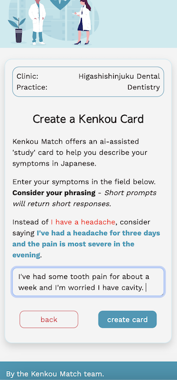

# 👨‍⚕️ KenkouMatch

This app will allow you to search for doctors in Japan by practice / specialty.
From the menu, you can search for symptoms (hardcoded keywords associated with practices)
Select the specialty that fits, and you can perform a search for nearby docs and / or create a translation card
The translation card takes your symptoms as input and will return to you the Japanese translation, associated keywords, and associated phrases.
You can regenerate the phrases / keywords, and save the ones you like to your favorites.


<br>

<br>

<br>

<br>
App home: http://kenkoumatch.herokuapp.com


## Getting Started
### Setup

Install gems
```
bundle install
```
Install JS packages
```
yarn install
```

### ENV Variables
Create `.env` file
```
touch .env
```
Inside `.env`, set these variables.
```
CLOUDINARY_URL=your_own_cloudinary_url_key
OPENAI_ACCESS_TOKEN=your_own_openai_key
GOOGLE_API_SERVER_KEY=your_own_google_api_key
DEEPL_AUTH_KEY=your_own_deepl_key
GOOGLE_API_BROWSER_KEY=your_own_google_api_key
```

### DB Setup
```
rails db:create
rails db:migrate
rails db:seed
```

### Run a server
```
rails s
```

## Built With
- [Rails 7](https://guides.rubyonrails.org/) - Backend / Front-end
- [Stimulus JS](https://stimulus.hotwired.dev/) - Front-end JS
- [Heroku](https://heroku.com/) - Deployment
- [PostgreSQL](https://www.postgresql.org/) - Database
- [Bootstrap](https://getbootstrap.com/) — Styling
- [Figma](https://www.figma.com) — Prototyping

## Acknowledgements
Inspiration comes from having a difficult time looking up healthcare before gaining Japanese proficiency, and doing small bits of research before doing anything day-to-day in Japan

## Team Members
- [Joe_Weber] (https://www.linkedin.com/in/jweber13/)
- [Ryo_Tamiya] (https://www.linkedin.com/in/ryo-tamiya-07832b8a/)
- [Mathieu_Belson] (https://www.linkedin.com/in/mathieu-belson-571a79145/)
- [Rashon_Rogers]


## Contributing
Pull requests are welcome. Please open an issue first to discuss what you would like to change.
